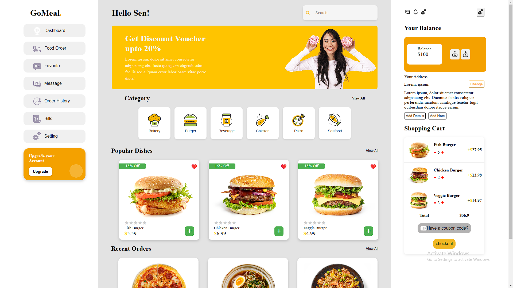

# ShoppingSiteReact

## Credits
- **Dashboard Design**: [Free Online Food Delivery Dashboard](https://gma.com/community/file/1225138473717238558/free-online-food-delivery-dashboard)

# 🛒 Shopping Website UI with Add-to-Cart  

A **React (Vite)**-powered shopping website UI with an **Add-to-Cart** feature, designed for a smooth and responsive user experience.  

## 🚀 Features  

- 🏗 **Component-Based Architecture**: Organized structure with `LeftSidebar`, `MainContent`, and `RightSidebar`.  
- 🛍 **Add-to-Cart Functionality**: Users can add/remove items dynamically with real-time cart updates.  
- 🎨 **Modern UI Design**: Responsive layout using **CSS Modules / Tailwind CSS**.  
- ⚡ **Optimized Performance**: Fast-loading UI with Vite and React Hooks (`useState`, `useEffect`).  

## 🖥️ Tech Stack  

- **Frontend**: React (Vite), JavaScript  
- **State Management**: React Hooks (`useState`, `useEffect`)  
- **Styling**: CSS Modules / Tailwind CSS  
- **Build Tool**: Vite  

